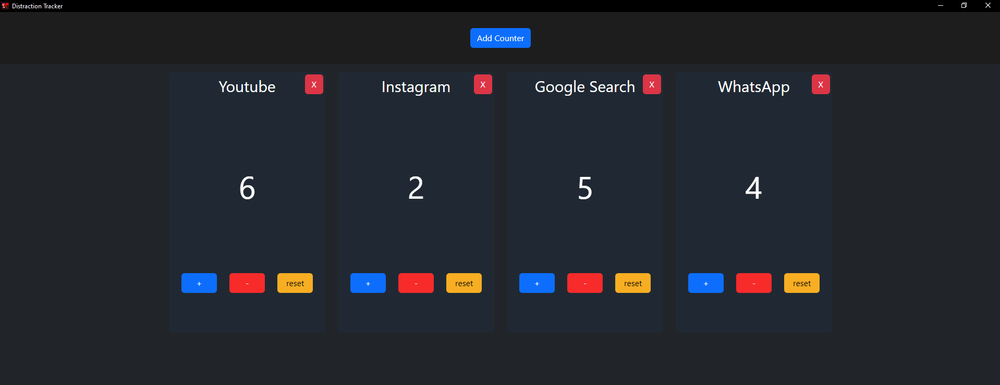

# Distraction Tracker


## Description

A simple desktop application that display different counters. Each time you get distracted you increment the corresponding counter.\
The goal is to also save the time the counter was incremented to be able to analyze the data later but this is not implemented yet.



## Installation

Clone the repository and install the dependencies with:
```bash
npm install
```


## Running & Building

This applications uses **electron-forge** with **webpack** to build the desktop application.\
You can run the application in development mode with the following command:
```bash
npm run start
```
or package the application with:
```bash
npm run package
```
Check the [package.json](package.json) file for more information.
